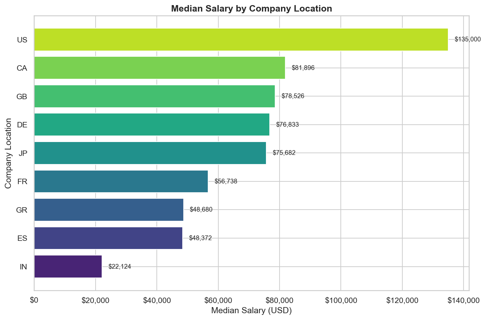
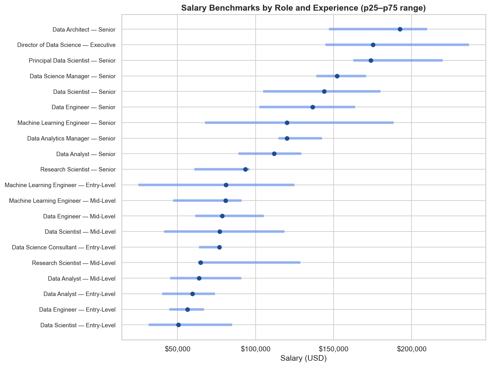

# Data & AI Job Market Analysis

**End-to-end analysis of global Data & AI job postings — from exploratory data analysis to practical, recruiter-ready salary recommendations across roles, experience levels and geographies.**

---

## Objectives

- Analyze salary distributions across Data & AI roles worldwide
- Identify the factors that actually drive compensation (experience, location, company size, remote work)
- Separate real effects from confounders using controlled comparisons and hypothesis testing
- Turn the analysis into usable outputs: salary benchmarks and hiring/career recommendations

## Tech Stack

| Tool | Purpose |
|------|---------|
| Python 3.12 | Core language |
| pandas / numpy | Data manipulation & cleaning |
| matplotlib / seaborn | Statistical visualizations |
| scipy | Hypothesis testing (Mann-Whitney U, Kruskal-Wallis) |
| Jupyter Notebook | Interactive analysis |

## Key Findings

1. **Location is the single biggest driver of pay.** A US-based role pays around $135k at the median, versus roughly $22k for a comparable role in India — a ~6x gap that dwarfs every other factor. On average, jobs outside the US pay a little under half of the US median.

2. **Experience matters more than the exact job title.** Within every role, the step up to Senior adds more to the salary than switching between Data Analyst, Data Scientist or Data Engineer at the same level.

3. **The "remote premium" is mostly an illusion.** Remote roles look better paid at first, but that is largely because senior people are overrepresented in them. Once experience is held constant, the premium only survives for senior positions.

4. **Company size only pays off in the US.** Large US companies pay a clear premium over small ones (about $148k vs $90k median), yet outside the US company size barely moves salaries at all.



A reference table of what each role pays at each experience level (25th–75th percentile ranges) is also produced and exported to `data/processed/salary_benchmarks.csv`:



Full methodology, statistical tests and caveats live in the two notebooks.

## Skills Demonstrated

- Data cleaning and feature engineering with pandas, organised as a reusable `src/` pipeline
- Exploratory data analysis and statistical storytelling with matplotlib and seaborn
- Non-parametric hypothesis testing for group differences (Mann-Whitney U, Kruskal-Wallis)
- Controlling for confounders — comparing naive vs adjusted results instead of taking raw numbers at face value
- Translating analysis into business recommendations and a concrete salary benchmark deliverable
- Reproducible, version-controlled workflow (git, pinned `requirements.txt`)

## Project Structure

```
data-ai-jobs-analysis/
├── data/
│   ├── raw/                          # Original Kaggle dataset
│   └── processed/                    # Exported salary benchmark table
├── notebooks/
│   ├── 01_eda.ipynb                  # Exploratory data analysis
│   └── 02_business_insights.ipynb    # Business questions & recommendations
├── src/
│   ├── clean.py                      # Data loading & cleaning pipeline
│   ├── features.py                   # Feature engineering utilities
│   └── visualize.py                  # Reusable chart functions
├── outputs/
│   └── figures/                      # Saved visualizations
├── requirements.txt
└── README.md
```

## How to Run

```bash
# Clone the repository
git clone https://github.com/FranciscoMartinezGrecco/Data-ai-jobs-analysis.git
cd Data-ai-jobs-analysis

# Install dependencies
pip install -r requirements.txt

# Launch Jupyter and run the notebooks in order (01 then 02)
jupyter notebook
```

## Dataset

- **Source:** [Kaggle — Data Science Job Salaries](https://www.kaggle.com/datasets/ruchi798/data-science-job-salaries)
- **Records:** 565 job postings (607 raw, 42 duplicates removed during cleaning)
- **Period:** 2020–2022
- **Features:** job title, experience level, employment type, salary (USD), remote ratio, company size, company location, employee residence

## Author

**Francisco Martinez Grecco**
Data Science Student @ UNSAM
- GitHub: [@FranciscoMartinezGrecco](https://github.com/FranciscoMartinezGrecco)
